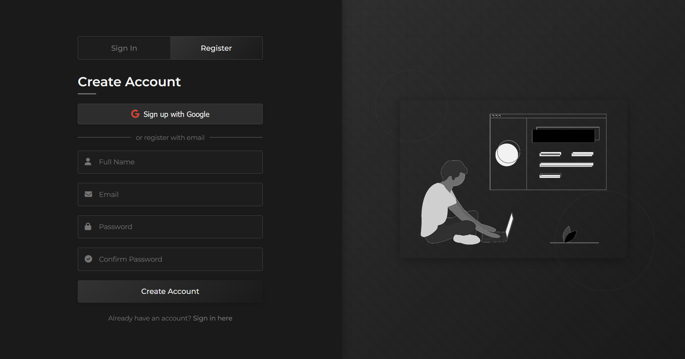

# 🚀 EduConnect Hub

> *Your all-in-one academic communication platform to connect students & faculty, answer questions, and collaborate on projects.*



---

## 🌟 About

EduConnect Hub is a **user-friendly communication hub** designed for academic departments.  
It helps students and faculty **connect, collaborate, and communicate efficiently** — all in one place.

---

## 🎯 Key Challenges Solved

- ✅ **Finding Help:** Quick answers to academic or administrative questions
- ✅ **Project Collaboration:** Share ideas, find teammates, and get mentorship
- ✅ **Central Communication:** Organized updates & discussions for the whole department

---

## ✨ Features

- 🧠 **Problem Solving:** Post questions and get matched with the right expert
- 🤝 **Project Collaboration:** Discover projects and join teams
- 🎨 **Simple Interface:** Clean, intuitive design for everyone
- 🔒 **Secure Access:** Protected login for students & faculty

---

## 👩‍🎓 How to Use

### For Students
1. Create an account with your academic email
2. Post a question or project idea
3. Get matched with an expert or collaborator
4. Track responses and get notifications

### For Faculty/Staff
1. Log in with department credentials
2. View and answer questions in your expertise
3. Mentor project teams and collaborate

---

## 🛠 Installation

### 📦 Frontend Setup
```bash
# Clone the repository
git clone https://github.com/yourusername/educonnect-hub.git

# Install dependencies
cd educonnect-hub/client
npm install

# Start the frontend
npm start
